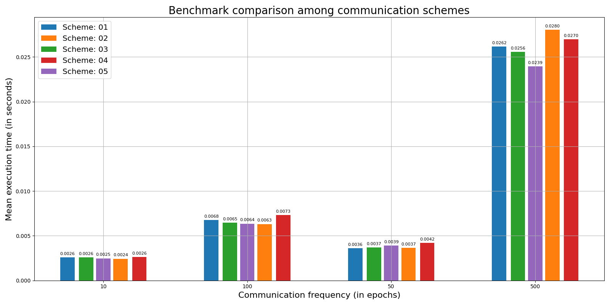
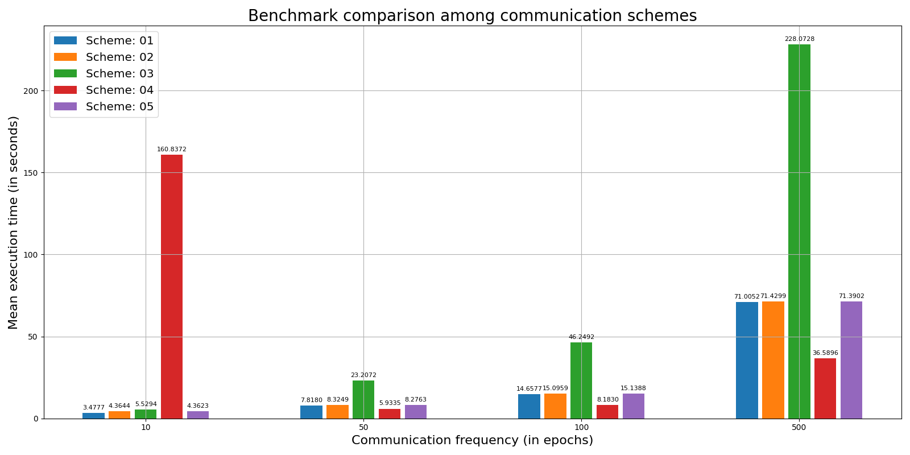

# High Performance Computing für Maschinelle Intelligenz (C++ / Python)
### Lehrstuhl für Datenverarbeitung | Wintersemester 2020 / 2021 | Gruppe 1

---

## Inhaltsverzeichnis

- [`Allgemeines zu diesem Projekt`](#allgemeines-zu-diesem-projekt)
- [`Repository-Struktur`](#repository-struktur)
- [`Kommmunikationsprotokolle`](#kommmunikationsprotokolle)
- [`Anlegen eines Branches für Evaluierungsprogramm`](#anlegen-eines-branches-für-evaluierungsprogramm)
- [`Erstellen des Hauptprogrammes`](#erstellen-des-hauptprogrammes)
- [`Erweitern des Projekts mit Protokollen`](#erweitern-des-projekts-mit-protokollen)
- [`Datenimport`](#datenimport)
- [`Evaluation verschiedener Implementierungen`](#evaluation-verschiedener-implementierungen)
- [`Programm ausführen`](#programm-ausführen)
- [`Benchmark Vergleich`](#benchmark-vergleich)
- [`OpenMPI installieren`](#openmpi-installieren)
- [`Gruppen Mitglieder`](#gruppen-mitglieder) 
- [`Anhang`](#anhang)

---

## Allgemeines zu diesem Projekt

In diesem Projekt wird eine asynchrone Value Iteration unter Zuhilfenahme von <a href="https://www.open-mpi.org/" target="_blank">`OpenMPI`</a> vorgestellt. Dabei werden verschiedene Strategien implementiert und anschließend einem Benchmark Vergleich unterzogen.

---

## Repository-Struktur

- <a href="data/" target="_blank">`data/`</a> - enthält Datensätze
- <a href="install_files/" target="_blank">`install_files/`</a> - enthält alle benötigten Debian-Dateien zum Installieren von <a href="https://www.open-mpi.org/" target="_blank">`OpenMPI`</a> [Version 2.2.1]
- <a href="lib/" target="_blank">`lib/`</a> - enthält alle benötigten Lirbraries
- <a href="results/" target="_blank">`results/`</a> - enthält die Resultate der Implementierungen
- <a href="src/" target="_blank">`src/`</a> - enthält implementierte Skripte
- <a href="CMakeLists.txt" target="_blank">`CMakeLists.txt`</a> - verantwortlich für Erstellen der `Makefile` zum Kompilieren
- <a href="Doxyfile" target="_blank">`Doxyfile`</a> - enthält ausführliche Dokumentation des Codes
- <a href="Makefile" target="_blank">`Makefile`</a> - verantwortlich für alle Interaktion mit dem Projekt
- <a href="hostfile" target="_blank">`hostfile`</a> - enthält alle Hosts auf denen das verteilte Rechnen laufen soll
- <a href="main.cpp" target="_blank">`main.cpp`</a> - Hauptskript, ruft Implementationen in <a href="src/" target="_blank">`src/`</a> auf und führt den Task aus

---

## Kommmunikationsprotokolle:

Aus Simplifikationsgründen - vor allem da die einzelnen Namen der Implementierungen sehr lange und unübersichtlich werden - sind die einzelnen Kommunikationsprotokolle nummeriert. Im Folgenden kann nachgelesen werden, welche Nummer welcher <a href="https://www.open-mpi.org/" target="_blank">`OpenMPI`</a>-Funktionalität entspricht.

| Name                                                                                           | OpenMPI Funktionen                    |
| ---------------------------------------------------------------------------------------------- | ------------------------------------- |
| <a href="src/vi_processor_impl_distr_01.cpp" target="_blank">`VI_Processor_Impl_Distr_01`</a>  | `Allgatherv`, `Allreduce`, `Gatherv`  |
| <a href="src/vi_processor_impl_distr_02.cpp" target="_blank">`VI_Processor_Impl_Distr_02`</a>  | `Send`, `Recv`, `Bcast`               |
| <a href="src/vi_processor_impl_distr_03.cpp" target="_blank">`VI_Processor_Impl_Distr_03`</a>  | `Sendrecv`, `Gatherv`                 |
| <a href="src/vi_processor_impl_distr_04.cpp" target="_blank">`VI_Processor_Impl_Distr_04`</a>  | `Isend`, `Irecv`, `Ibcast`, `Igatherv`|
| <a href="src/vi_processor_impl_distr_05.cpp" target="_blank">`VI_Processor_Impl_Distr_05`</a>  | `Igatherv`, `Bcast`, `Gatherv`        |

Umfangreiche Dokumenation zu möglichen <a href="https://www.open-mpi.org/" target="_blank">`OpenMPI`</a> Kommunicationsprotokollen und deren Funktionen: [`Princeton Bootcamp Kommunikationsprotokolle`](https://princetonuniversity.github.io/PUbootcamp/sessions/parallel-programming/Intro_PP_bootcamp_2018.pdf) bzw. <a href="https://www.open-mpi.org/doc/v2.1/" target="_blank">`offizielle Dokumentation der genutzten OpenMPI Version [2.1.1]`</a>. Für Vergleichszwecke wurde <a href="src/vi_processor_impl_local.cpp" target="_blank">`VI_Processor_Impl_Local`</a> implementiert, welche die Implementation der synchronen `Value Iteration` aus Hausaufgabe 2 ist

Nähere Informationen über die einzelnen Implementierungen können in <a href="src/" target="_blank">`src/`</a> bzw. den einzelnen Skripts selbst nachgelesen werden

---

## Anlegen eines Branches für Evaluierungsprogramm

Das Evaluierungsprogramm soll nur dazu dienen die performanteste Implementierung zu ermitteln. Für die eigentliche Value Iteration Aufgabe erstellen wir im Master-Branch eine <a href="main.cpp" target="_blank">`main.cpp`</a> Datei welcher wir z.B. via Kommandozeilenargumenten den Ordner zu den Daten sowie den Pfad in dem die Ergebnisse gespeichert werden sollen angeben.

---

## Erstellen des Hauptprogrammes

- Einlesen des Datenordner Pfades und des Resultateordner Pfades via Kommandozeilenargument
- Optimal Values und optimal Strategy im Numpy Format im Resultateordner abspeichern, sodass es mit dem Script `data_demonstration.py` aus Hausaufgabe 2 verwendet werden kann.

---

## Erweitern des Projekts mit Protokollen

Wir können hier verschiedene VI Implementierungen und Kommunikationsstrategien ausprobieren indem einfach eine von <a href="src/vi_processor_base.h" target="_blank">` VI_Processor_Base`</a> abgeleitete Klasse implementiert wird (siehe als Beispiel <a href="src/vi_processor_impl_local.cpp" target="_blank">`VI_Processor_Impl_Local`</a> oder <a href="src/vi_processor_impl_distr_01.cpp" target="_blank">`VI_Processor_Impl_Distr_01`</a>). 


---

## Datenimport

Die Daten werden durch die <a href="Makefile" target="_blank">`Makefile`</a> während des Kompilierens mittels <a href="data/convert_pickle.py" target="_blank">`convert_pickle.py`</a> aus dem `.pickle`-Format in ein `.npz`-Format umgewandelt, welches durch die Bibliothek <a href="https://github.com/rogersce/cnpy" target="_blank">`"cnpy" by Carl Rogers`</a> eingelesen werden.

---

## Evaluation verschiedener Implementierungen

Wenn mehrere Implementierungen verglichen werden sollen wird in der <a href="main.cpp" target="_blank">`main.cpp`</a> eine Liste erstellt welche mehrere konkrete Implementierungen enthält. Dann Messen wir iterativ für jede Implementierung die Berechnungszeit (jeweils ~20 mal) und vergleichen die mittlere Ausführungsdauer und eventuell auch deren Standardabweichung.

---

## Programm ausführen

1. Melde dich über ssh auf einem HPC Rechner (Bsp: `hpc05`) an
2. Wechsele in das `LRZ-Home` Verzeichnis
3. Klone das Repository

```text
# Auf HPC Rechner anmelden
ssh hpc05

# In das LRZ-Home Verzeichnis wechseln
cd lrz-nashome

# Repository klonen
git clone https://gitlab.ldv.ei.tum.de/cpp-lk20/gruppe1.git

# Bzw. neuesten Stand pullen (wenn Projekt schon vorhanden ist)
cd gruppe1
git pull origin master

# In Master Branch wechseln
git checkout master
```

Dann kann das Projekt kompiliert und ausgeführt werden. Hierfür gibt es mehrere Möglichkeiten:

```text

1. Lokales Ausführen auf einer pysikalischen Maschine 
   (Anzahl der dabei gestarteten Prozesse: 2)

1.1 make run_debug_local

-------------------------------------------------------------

2. Verteiltes Rechnen auf mehreren pysikalischen Maschinen
   (Manuelle auswahl des Datensatzes)

2.1 make run_debug (Start mit dem "debug" Datensatz)

    oder
  
2.2 make run_small (Start mit dem "small" Datensatz)

    oder

2.3 make run_normal (Start mit dem "normal" Datensatz)

-------------------------------------------------------------

3. Verteiltes Rechnen auf mehreren pysikalischen Maschinen
   (Es werden alle Datensätze sequentiell abgearbeitet)

3.1 make run_all

-------------------------------------------------------------

4. Manuelles Ausführen

1.1 make compile

1.2 cd build

1.3 mpirun -np 6 -hostfile ../hostfile ./MPI_Project.exe "<Pfad_zu_Daten_Ordner>" "<Pfad_zu_Results_Ordner>" <Anzahl_der_Runs>

```

Hinweis: Überprüfe, ob die `~/.ssh/config` richtig ist:
```text
# Put this file in ~/.ssh/ with the name 'config'

# Matches hpc01 hpc02 and so on, %h gets the actual match, e.g. hpc06, and completes the host name
# A wildcard is possible (e.g. hpc*), but this disables the tab completion

Host hpc01 hpc02 hpc03 hpc04 hpc05 hpc06 hpc07 hpc08 hpc09 hpc10 hpc11 hpc12 hpc13 hpc14 hpc15
  HostName %h.clients.eikon.tum.de

# Configuration for all hosts (matches always)

Host *
  User DeinUserName
  ForwardX11 yes
  Compression yes
```
## Benchmark Vergleich

In unten stehenden Grafiken sind Benchmark Vergleiche über alle implementierten Kommunikationsprotokolle für die verschiedenen Datensätze zu sehen.

<a href="data/data_debug/" target="_blank">`data_debug/`</a>

<h2 align="center">
  
</h2>

<a href="data/data_small/" target="_blank">`data_small/`</a>

<h2 align="center">
  
</h2>

---

## OpenMPI installieren

Installer Dateien sind im Ordner <a href="install_files/" target="_blank">`install_files/`</a> abgelegt und müssen in nachfolgender Reihenfolge installiert werden (Linux Umgebung: Ubuntu, WSL2, etc.). Anschließend ist Version `2.2.1` installiert.
```cmd
1. cd install_files
2. sudo dpkg -i libhwloc5_1.11.9-1_amd64.deb
3. sudo dpkg -i libopenmpi2_2.1.1-8_amd64.deb
4. sudo dpkg -i openmpi-common_2.1.1-8_all.deb
5. sudo dpkg -i openmpi-bin_2.1.1-8_amd64.deb
```
---

## Gruppen Mitglieder

|                             |                             |
| --------------------------- | --------------------------- |
| Stümke, Daniel              | daniel.stuemke@tum.de       |
| Christoph, Alexander        | alexander.christoph@tum.de  |
| Kiechle, Johannes           | johannes.kiechle@tum.de     |
| Gottwald, Martin (Dozent)   | martin.gottwald@tum.de      |
| Hein, Alice (Dozentin)      | alice.hein@tum.de           |

---

## Anhang

<a href="https://www.open-mpi.org/" target="_blank">`OpenMPI`</a> Versionen auf den Eikon Rechnern

| HPC Rechner          | OpenMPI Version        |
| -------------------- | ---------------------- |
| `hpc01`              | `2.2.1`                |
| `hpc02`              | `2.2.1`                |
| `hpc03`              | `2.2.1`                |
| `hpc04`              | `nicht erreichbar`     |
| `hpc05`              | `2.2.1`                |
| `hpc06`              | `2.2.1`                |
| `hpc07`              | `2.2.1`                |
| `hpc08`              | `2.2.1`                |
| `hpc09`              | `2.2.1`                |
| `hpc10`              | `2.2.1`                |
| `hpc11`              | `2.2.1`                |
| `hpc12`              | `2.2.1`                |
| `hpc13`              | `2.2.1`                |
| `hpc14`              | `nicht erreichbar`     |
| `hpc15`              | `2.2.1`                |
