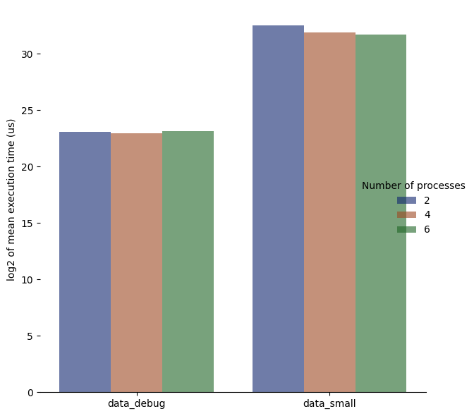

# `results`

contains all results from all datasets

  

-------

## <a href='data_debug-2/' target='_blank'>`data_debug-2/`</a> --- <a href='data_debug-4/' target='_blank'>`data_debug-4/`</a> --- <a href='data_debug-6/' target='_blank'>`data_debug-6/`</a> --- <a href='data_debug-8/' target='_blank'>`data_debug-8/`</a>

folders containing the results for the mini dataset (with respective number of used processors), for debugging purposes only

  

-------

## <a href='data_small-2/' target='_blank'>`data_small-2/`</a> --- <a href='data_small-4/' target='_blank'>`data_small-4/`</a> --- <a href='data_small-6/' target='_blank'>`data_small-6/`</a> --- <a href='data_small-8/' target='_blank'>`data_small-8/`</a>

folders containing the results for the small dataset (with respective number of used processors), contains much more data. For evaluation purposes

  

-------

## <a href='data_normal-2/' target='_blank'>`data_normal-2/`</a> --- <a href='data_normal-4/' target='_blank'>`data_normal-4/`</a> --- <a href='data_normal-6/' target='_blank'>`data_normal-6/`</a> --- <a href='data_normal-8/' target='_blank'>`data_normal-8/`</a>

folders containing the results for the big dataset (with respective number of used processors), contains the most data. For evaluation purposes

  

-------

## <a href="benchmark_comm_period.py" target="_blank">`benchmark_comm_period.py`</a>

processes the benchmark comparison for all implementations graphically

  

-------

## <a href="benchmark_np.png" target="_blank">`benchmark_np.png`</a>

benchmark comparison between number of used processors

<h2 align="center">
  
</h2>

  

-------

## <a href="benchmark_np.py" target="_blank">`benchmark_np.py`</a>

processes a benchmark comparison for different number of used processors graphically